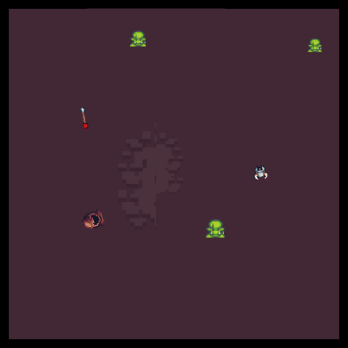

<p align="center">
    <a href="docs/assets/offline_marl_diagram.jpg">
        
    </a>
</p>

<h2 align="center">
    <p>Offline Multi-Agent Reinforcement Learning Datasets and Baselines</p>
</h2>
<p align="center">
    <a href="https://www.python.org/doc/versions/">
        
    </a>
    <a href="https://opensource.org/licenses/Apache-2.0">
        
    </a>
    <a href="https://arxiv.org/abs/2302.00521">
        
    </a>
    <a href="https://github.com/instadeepai/og-marl/actions/workflows/tests_linters.yml">
        
    </a>
    <a href="https://github.com/psf/black">
        
    </a>
    <a href="http://mypy-lang.org/">
        
    </a>
</p>

<p align="center">
    <a href="docs/assets/offline_marl_diagram.jpg">
        
    </a>
</p>

## Going Off-the-Grid! 🤖 ⚡ 🔌 🔋

Offline MARL holds great promise for real-world applications by utilising static datasets to build decentralised controllers of complex multi-agent systems. However, currently offline MARL lacks a standardised benchmark for measuring meaningful research progress. Off-the-Grid MARL (OG-MARL) fills this gap by providing a diverse suite of datasets with baselines on popular MARL benchmark environments in one place, with a unified API and an easy-to-use set of tools.

OG-MARL forms part of the [InstaDeep](https://www.instadeep.com/) MARL [ecosystem](#see-also-🔎), developed jointly with the open-source
community. To join us in these efforts, reach out, raise issues or just
🌟 to stay up to date with the latest developments! 📢 You can contribute to the conversation around OG-MARL in the [Discussion tab](https://github.com/instadeepai/og-marl/discussions). Please don't hesitate to leave a comment. We will be happy to reply.

> 📢 We recently moved our datasets to Hugging Face. This means that previous download links for the datasets may no longer work. Datasets can now be downloaded directly from [Hugging Face](https://huggingface.co/datasets/InstaDeepAI/og-marl).

## Quickstart 🏎️
Clone this repository.

`git clone https://github.com/instadeepai/og-marl.git`

Install `og-marl` and its dependencies. We tested `og-marl` with Python 3.9. Consider using a `conda` virtual environment.

`pip install -e .`

`pip install flashbax==0.1.2`

Download environment dependencies. We will use SMACv1 in this example.

`bash install_environments/smacv1.sh`

Download a dataset.

`python examples/download_dataset.py --env=smac_v1 --scenario=3m`

Run a baseline. In this example we will run MAICQ.

`python baselines/main.py --env=smac_v1 --scenario=3m --dataset=Good --system=maicq`

## Dataset API 🔌

We provide a simple demonstrative notebook of how to use OG-MARL's dataset API here:

[](https://colab.research.google.com/github/instadeepai/og-marl/blob/main/examples/dataset_api_demo.ipynb)

> ⚠️ If you are having issues with downloading our datasets, it may because you are downloading from a region far from where we are hosting the datasets. As an alternative, please try this [Google Drive link](https://drive.google.com/drive/folders/1lw-e5VwIdCtmsGWgQG902yZRArU69TrH?usp=sharing) instead.

## Datasets 🎥

We have generated datasets on a diverse set of popular MARL environments. A list of currently supported environments is included in the table below. It is well known from the single-agent offline RL literature that the quality of experience in offline datasets can play a large role in the final performance of offline RL algorithms. Therefore in OG-MARL, for each environment and scenario, we include a range of dataset distributions including `Good`, `Medium`, `Poor` and `Replay` datasets in order to benchmark offline MARL algorithms on a range of different dataset qualities. For more information on why we chose to include each environment and its task properties, please read our accompanying [paper](https://arxiv.org/abs/2302.00521).

<div class="collage">
  <div class="row" align="center">
    
    
    
    
    
  </div>
  <div class="row" align="center">
    
    
    
    
    
  </div>
</div>

<br/>

### Environments and Scenarios in OG-MARL 🗺️

| Environment | Scenario | Agents | Act | Obs | Reward | Types | Repo |
|-----|----|----|-----|-----|----|----|-----|
| 🔫SMAC v1 | 3m <br/> 8m <br/> 2s3z <br/> 5m_vs_6m <br/> 27m_vs_30m <br/> 3s5z_vs_3s6z <br/> 2c_vs_64zg| 3 <br/> 8 <br/> 5 <br/> 5 <br/> 27 <br/> 8 <br/> 2 | Discrete  | Vector   |  Dense | Homog <br/> Homog <br/> Heterog <br/> Homog <br/> Homog <br/> Heterog <br/> Homog |[source](https://github.com/oxwhirl/smac) |
| 💣SMAC v2 | terran_5_vs_5 <br/> zerg_5_vs_5 <br/> terran_10_vs_10 | 5 <br/> 5 <br/> 10 | Discrete | Vector | Dense | Heterog | [source](https://github.com/oxwhirl/smacv2) |
| 🚅Flatland | 3 Trains  <br/> 5 Trains | 3 <br/> 5 | Discrete | Vector | Sparse | Homog | [source](https://flatland.aicrowd.com/intro.html) |
| 🐜MAMuJoCo | 2x3 HalfCheetah <br/> 2x4 Ant <br/> 4x2 Ant | 2 <br/> 2 <br/> 4 | Cont. | Vector | Dense | Heterog <br/> Homog <br/> Homog | [source](https://github.com/schroederdewitt/multiagent_mujoco) |
| 🐻PettingZoo | Pursuit  <br/> Co-op Pong | 8 <br/> 2 | Discrete <br/> Discrete  | Pixels <br/> Pixels | Dense | Homog <br/> Heterog | [source](https://pettingzoo.farama.org/) |

Our datasets are now hosted on Hugging Face to further improve accessibility for the community. A few datasets have yet to be uploaded, but will be very soon.

> [https://huggingface.co/datasets/InstaDeepAI/og-marl](https://huggingface.co/datasets/InstaDeepAI/og-marl)


### Datasets from Prior Works 🥇
We recently converted several datasets from prior works to Vaults and benchmarked our baseline algorithms on them. For more information, see our [technical report](https://arxiv.org/abs/2406.09068) on ArXiv. All of the code for re-running the experiments is available on the following branch of this repository:

> [https://github.com/instadeepai/og-marl/tree/baselines-code](https://github.com/instadeepai/og-marl/tree/baselines-code).

We include the following datasets from prior works.

| Paper | Environment | Scenario | Source |
|-----|----|----|-----|
| [Pan et al. (2022)](https://proceedings.mlr.press/v162/pan22a/pan22a.pdf) | 🐜MAMuJoCo | 2x3 HalfCheetah | [source](https://github.com/ling-pan/OMAR) |
| [Pan et al. (2022)](https://proceedings.mlr.press/v162/pan22a/pan22a.pdf) | 🔴MPE | simple_spread | [source](https://github.com/ling-pan/OMAR) |
| [Shao et al. (2023)](https://openreview.net/forum?id=62zmO4mv8X) | 🔫SMAC v1 | 5m_vs_6m <br/> 2s3z <br/> 3s_vs_5z <br/> 6h_vs_8z | [source](https://github.com/thu-rllab/CFCQL) |
| [Wang et al. (2023)](https://papers.nips.cc/paper_files/paper/2023/hash/a46c84276e3a4249ab7dbf3e069baf7f-Abstract-Conference.html) | 🔫SMAC v1 | 5m_vs_6m <br/> 6h_vs_8z <br/> 2c_vs_64zg <br/> corridor| [source](https://github.com/ZhengYinan-AIR/OMIGA) |
| [Wang et al. (2023)](https://papers.nips.cc/paper_files/paper/2023/hash/a46c84276e3a4249ab7dbf3e069baf7f-Abstract-Conference.html) | 🐜MAMuJoCo | 6x1 HalfCheetah <br/> 3x1 Hopper <br/> 2x4 Ant| [source](https://github.com/ZhengYinan-AIR/OMIGA) |

## See Also 🔎

**InstaDeep's MARL ecosystem in JAX.** In particular, we suggest users check out the following sister repositories:

* 🦁 [Mava](https://github.com/instadeepai/Mava): a research-friendly codebase for distributed MARL in JAX.
* 🌴 [Jumanji](https://github.com/instadeepai/jumanji): a diverse suite of scalable reinforcement learning environments in JAX.
* 😎 [Matrax](https://github.com/instadeepai/matrax): a collection of matrix games in JAX.
* 🔦 [Flashbax](https://github.com/instadeepai/flashbax): accelerated replay buffers in JAX.
* 📈 [MARL-eval](https://github.com/instadeepai/marl-eval): standardised experiment data aggregation and visualisation for MARL.

**Related.** Other libraries related to accelerated MARL in JAX.

* 🦊 [JaxMARL](https://github.com/flairox/jaxmarl): accelerated MARL environments with baselines in JAX.
* ♟️  [Pgx](https://github.com/sotetsuk/pgx): JAX implementations of classic board games, such as Chess, Go and Shogi.
* 🔼 [Minimax](https://github.com/facebookresearch/minimax/): JAX implementations of autocurricula baselines for RL.

## Citing OG-MARL :pencil2:

If you use OG-MARL in your work, please cite the library using:

```
@inproceedings{formanek2023ogmarl,
    author = {Formanek, Claude and Jeewa, Asad and Shock, Jonathan and Pretorius, Arnu},
    title = {Off-the-Grid MARL: Datasets and Baselines for Offline Multi-Agent Reinforcement Learning},
    year = {2023},
    publisher = {AAMAS},
    booktitle = {Extended Abstract at the 2023 International Conference on Autonomous Agents and Multiagent Systems},
}
```


## Acknowledgements 🙏

The development of this library was supported with Cloud TPUs
from Google's [TPU Research Cloud](https://sites.research.google/trc/about/) (TRC) 🌤.
