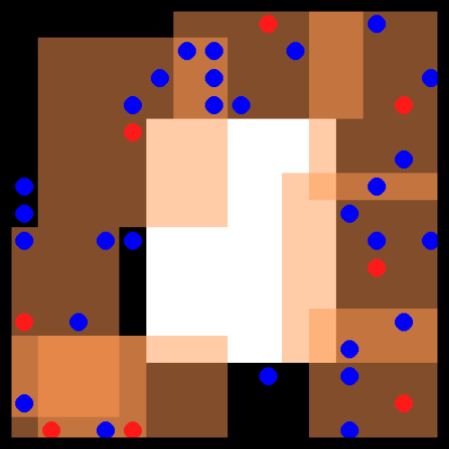
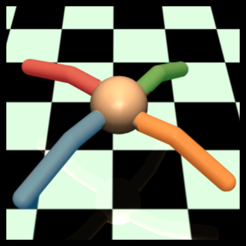
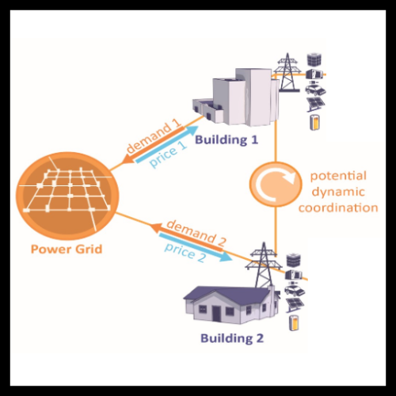

<p align="center">
    <picture>
        <source media="(prefers-color-scheme: dark)" srcset="docs/assets/og_marl_logo_short_dm.png">
        <source media="(prefers-color-scheme: light)" srcset="docs/assets/og_marl_logo_short.png">
        
    </picture>
</p>

<h2 align="center">
    <p>Off-the-Grid MARL: Offline Multi-Agent Reinforcement Learning made easy</p>
</h2>
<p align="center">
    <a href="https://www.python.org/doc/versions/">
        
    </a>
    <a href="https://opensource.org/licenses/Apache-2.0">
        
    </a>
    <a href="https://arxiv.org/abs/2302.00521">
        
    </a>
    <a href="https://sites.google.com/view/og-marl">
        
    </a>
</p>

<p align="center">
    <a href="docs/assets/offline_marl_diagram.jpg">
        
    </a>
</p>

## Going Off-the-Grid! 🤖 ⚡ 🔌 🔋

<div align="center">
<h3>

[**Installation**](#installation-) | [**Quickstart**](#quickstart-)

</div>

Offline MARL holds great promise for real-world applications by utilising static datasets to build decentralised controllers of complex multi-agent systems. However, currently offline MARL lacks a standardised benchmark for measuring meaningful research progress. Off-the-Grid MARL (OG-MARL) fills this gap by providing a diverse suite of datasets with baselines on popular MARL benchmark environments in one place, with a unified API and an easy-to-use set of tools.

OG-MARL forms part of the [InstaDeep](https://www.instadeep.com/) MARL [ecosystem](#see-also-🔎), developed jointly with the open-source
community. To join us in these efforts, reach out, raise issues and read our
[contribution guidelines](docs/CONTRIBUTING.md) or just
🌟 to stay up to date with the latest developments!

## Datasets 🎥

We have generated datasets on a diverse set of popular MARL environments. A list of currently supported environments is included in the table below. It is well known from the single-agent offline RL literature that the quality of experience in offline datasets can play a large role in the final performance of offline RL algorithms. Therefore in OG-MARL, for each environment and scenario, we include a range of dataset distributions including `Good`, `Medium`, `Poor` and `Replay` datasets in order to benchmark offline MARL algorithms on a range of different dataset qualities. For more information on why we chose to include each environment and its task properties, please read our accompanying [paper](https://arxiv.org/abs/2302.00521).

<div class="collage">
  <div class="row" align="center">
<!--      -->
    
    
    
    
  </div>
  <div class="row" align="center">
    
    
    
    
  </div>
</div>

<br/>

<div align="center">

| Environment | Scenario | Agents | Act | Obs | Reward | Types | Repo
| --- | ---| --- | --- | --- | --- | --- | --- |
| 🔫SMAC v1 | 3m <br/> 8m <br/> 2s3z <br/> 5m_vs_6m <br/> 27m_vs_30m <br/> 3s5z_vs_3s6z <br/> 2c_vs_64zg| 3 <br/> 8 <br/> 5 <br/> 5 <br/> 27 <br/> 8 <br/> 2 | Discrete  | Vector   |  Dense | Homog <br/> Homog <br/> Heterog <br/> Homog <br/> Homog <br/> Heterog <br/> Homog |[source](https://github.com/oxwhirl/smac) |
| 💣SMAC v2 | terran_5_vs_5 <br/> zerg_5_vs_5 <br/> terran_10_vs_10 | 5 <br/> 5 <br/> 10 | Discrete | Vector | Dense | Heterog | [source](https://github.com/oxwhirl/smacv2) |
| 🐻PettingZoo | Pursuit  <br/> Co-op Pong <br/> PistonBall | 8 <br/> 2 <br/> 15 | Discrete <br/> Discrete <br/> Cont. | Pixels | Dense | Homog <br/> Heterog <br/> Homog | [source](https://pettingzoo.farama.org/) |
| 🚅Flatland | 3 Trains  <br/> 5 Trains | 3 <br/> 5 | Discrete | Vector | Dense | Homog | [source](https://flatland.aicrowd.com/intro.html) |
| 🐜MAMuJoCo | 2-HalfCheetah <br/> 2-Ant <br/> 4-Ant | 2 <br/> 2 <br/> 4 | Cont. | Vector | Dense | Heterog <br/> Homog <br/> Homog | [source](https://github.com/schroederdewitt/multiagent_mujoco) |
| 🏙️CityLearn | 2022_all_phases | 17 | Cont. | Vector | Dense | Homog | [source](https://github.com/intelligent-environments-lab/CityLearn) |
| 🔌Voltage Control | case33_3min_final | 6 | Cont. | Vector | Dense | Homog | [source](https://github.com/Future-Power-Networks/MAPDN) |

</div>

<h2 name="install" id="install">Installation 🎬</h2>

To install og-marl run the following command.

`pip install -e .["datasets","baselines"]`

### Installing Environments ⛰️

Depending on the environment you want to use, you should install that environments dependencies. We provide convenient shell scripts for this.

`bash install_environments/<environment_name>.sh`

You should replace `<environment_name>` with the name of the environment you want to install.

Installing several different environments dependencies in the same python virtual environment (or conda environment) may work in some cases but in others, they may have conflicting requirements. So we reccomend maintaining a different virtual environment for each environment.

### Downloading Datasets ⏬

Next you need to download the dataset you want to use and add it to the correct file path. Go to the OG-MARL website (<https://sites.google.com/view/og-marl>) and download the dataset. Once the zip file is downloaded add it to a directory called `datasets` on the same level as the `og-marl/` directory. The folder structure should look like this:

```
examples/
    |_> ...
og_marl/
    |_> ...
datasets/
    |_> smacv1/
        |_> 3m/
        |   |_> Good/
        |   |_> Medium/
        |   |_> Poor/
        |_> ...
    |_> smacv2/
        |_> terran_5_vs_5/
        |   |_> Good/
        |   |_> Medium/
        |   |_> Poor/
        |_> ...
```

**Note:** because we support many different environments, each with their own set of dependencies which are often conflicting, it might be required that you follow slightly different installation instructions for each environment. For this, we recommend reading the [detailed installation guide](docs/INSTALL.md).

<h2 name="quickstart" id="quickstart">Quickstart ⚡</h2>

Below we provide a code snippet demonstrating the ease of use of OG-MARL. The code shows how to record and load datasets in a simple example using the `3m` scenario from SMAC. We also provide a detailed [tutorial](docs/TUTORIALS.md) for a step-by-step guide across multiple environments.

```python
from og_marl import SMAC
from og_marl import QMIX
from og_marl import OfflineLogger

# Instantiate environment
env = SMAC("3m")

# Wrap env in offline logger
env = OfflineLogger(env)

# Make multi-agent system
system = QMIX(env)

# Collect data
system.run_online()

# Load dataset
dataset = env.get_dataset("Good")

# Train offline
system.run_offline(dataset)
```

## Roadmap 🗺️

We are currently working on a large refactor of OG-MARL to get rid of the dependency on reverb and launchpad. This will make the code a lot easier to work with. The current progress on the refactor can be followed on the branch `refactor/remove-reverb-and-launchpad`.

Offline MARL also lends itself well to the new wave of hardware-accelerated research and development in the
field of RL. **In the near future, we plan to release a JAX version of OG-MARL.**

<h2 name="citing" id="citing">Citing OG-MARL ✏️</h2>

If you use OG-MARL in your work, please cite the library using:

```
@misc{formanek2023offthegrid,
      title={Off-the-Grid MARL: a Framework for Dataset Generation with Baselines for Cooperative Offline Multi-Agent Reinforcement Learning}, 
      author={Claude Formanek and Asad Jeewa and Jonathan Shock and Arnu Pretorius},
      year={2023},
      eprint={2302.00521},
      archivePrefix={arXiv},
      primaryClass={cs.LG}
}
```

## See Also 🔎

Other works that form part of InstaDeep's MARL ecosystem in JAX.
In particular, we suggest users check out the following sister repositories:

* 🦁 [Mava](https://github.com/instadeepai/Mava) is a research-friendly codebase for fast experimentation of multi-agent reinforcement learning in JAX.
* 🌴 [Jumanji](https://github.com/instadeepai/jumanji) is a diverse suite of scalable reinforcement learning environments in JAX.
* 😎 [Matrax](https://github.com/instadeepai/matrax) is a collection of matrix games in JAX.
