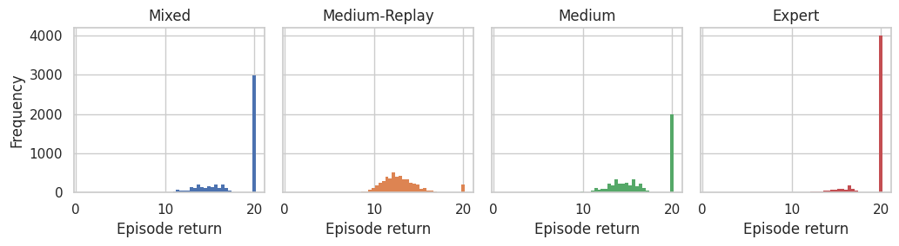
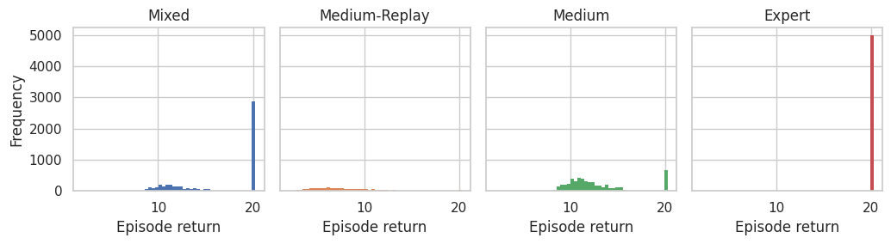

<!DOCTYPE html><html lang="en"><head>    <meta charset="UTF-8">    <meta name="viewport" content="width=device-width, initial-scale=1.0">    <title>Dataset Cards - CFCQL</title>    <link rel="stylesheet" href="styles.css">    </head><body>    
        <h1>Dataset Cards - CFCQL</h1>        

<h2>6h_vs_8z - <a href='https://huggingface.co/datasets/InstaDeepAI/og-marl/resolve/main/prior_work/cfcql/smac_v1/6h_vs_8z.zip'>Download</a></h2><h3>Metadata</h3>
<table><tr><th>Environment name</th><th>Version</th><th>Agents</th><th>Action size</th><th>Observation size</th><th>Reward type</th></tr><tr><td>SMAC (v1)</td><td><a href='https://github.com/oxwhirl/smac/releases/tag/v1'>SMAC V1</a>, from OxWhiRL</td><td>6</td><td>1</td><td>[78]</td><td>Dense</td></tr></table>
<h3>Generation procedure for each dataset</h3>
Converted from cfcql format to a Vault.
<h3>Summary statistics</h3>
<table><tr><th>Uid</th><th>Episode return mean</th><th>Min return</th><th>Max return</th><th>Transitions</th><th>Trajectories</th><th>Joint SACo</th></tr><tr><td>Mixed</td><td>17.81 &#177; 2.88</td><td>9.14</td><td>20.17</td><td>217723</td><td>5000</td><td>0.24</td></tr><tr><td>Medium-Replay</td><td>12.97 &#177; 2.22</td><td>0.81</td><td>20.03</td><td>182403</td><td>5000</td><td>1.00</td></tr><tr><td>Medium</td><td>16.63 &#177; 3.03</td><td>9.80</td><td>20.00</td><td>207008</td><td>5000</td><td>0.12</td></tr><tr><td>Expert</td><td>19.01 &#177; 2.11</td><td>9.14</td><td>20.17</td><td>228120</td><td>5000</td><td>0.12</td></tr></table>

<h2>3s_vs_5z - <a href='https://huggingface.co/datasets/InstaDeepAI/og-marl/resolve/main/prior_work/cfcql/smac_v1/3s_vs_5z.zip'>Download</a></h2><h3>Metadata</h3>
<table><tr><th>Environment name</th><th>Version</th><th>Agents</th><th>Action size</th><th>Observation size</th><th>Reward type</th></tr><tr><td>SMAC (v1)</td><td><a href='https://github.com/oxwhirl/smac/releases/tag/v1'>SMAC V1</a>, from OxWhiRL</td><td>3</td><td>1</td><td>[48]</td><td>Dense</td></tr></table>
<h3>Generation procedure for each dataset</h3>
Converted from cfcql format to a Vault.
<h3>Summary statistics</h3>
<table><tr><th>Uid</th><th>Episode return mean</th><th>Min return</th><th>Max return</th><th>Transitions</th><th>Trajectories</th><th>Joint SACo</th></tr><tr><td>Mixed</td><td>21.04 &#177; 2.51</td><td>5.58</td><td>29.00</td><td>888375</td><td>5000</td><td>0.23</td></tr><tr><td>Medium-Replay</td><td>18.85 &#177; 4.20</td><td>4.03</td><td>28.53</td><td>1082739</td><td>5000</td><td>0.99</td></tr><tr><td>Medium</td><td>20.86 &#177; 3.47</td><td>5.58</td><td>29.00</td><td>1174576</td><td>5000</td><td>0.11</td></tr><tr><td>Expert</td><td>21.19 &#177; 0.70</td><td>9.21</td><td>24.87</td><td>600520</td><td>5000</td><td>0.12</td></tr></table>

<h2>5m_vs_6m - <a href='https://huggingface.co/datasets/InstaDeepAI/og-marl/resolve/main/prior_work/cfcql/smac_v1/5m_vs_6m.zip'>Download</a></h2><h3>Metadata</h3>
<table><tr><th>Environment name</th><th>Version</th><th>Agents</th><th>Action size</th><th>Observation size</th><th>Reward type</th></tr><tr><td>SMAC (v1)</td><td><a href='https://github.com/oxwhirl/smac/releases/tag/v1'>SMAC V1</a>, from OxWhiRL</td><td>5</td><td>1</td><td>[55]</td><td>Dense</td></tr></table>
<h3>Generation procedure for each dataset</h3>
Converted from cfcql format to a Vault.
<h3>Summary statistics</h3>
<table><tr><th>Uid</th><th>Episode return mean</th><th>Min return</th><th>Max return</th><th>Transitions</th><th>Trajectories</th><th>Joint SACo</th></tr><tr><td>Mixed</td><td>15.11 &#177; 5.11</td><td>6.38</td><td>20.00</td><td>131703</td><td>5000</td><td>0.22</td></tr><tr><td>Medium-Replay</td><td>9.02 &#177; 2.59</td><td>4.57</td><td>20.00</td><td>118405</td><td>5000</td><td>0.96</td></tr><tr><td>Medium</td><td>12.05 &#177; 4.36</td><td>6.38</td><td>20.00</td><td>135256</td><td>5000</td><td>0.10</td></tr><tr><td>Expert</td><td>18.17 &#177; 3.79</td><td>7.13</td><td>20.00</td><td>128536</td><td>5000</td><td>0.12</td></tr></table>

<h2>2s3z - <a href='https://huggingface.co/datasets/InstaDeepAI/og-marl/resolve/main/prior_work/cfcql/smac_v1/2s3z.zip'>Download</a></h2><h3>Metadata</h3>
<table><tr><th>Environment name</th><th>Version</th><th>Agents</th><th>Action size</th><th>Observation size</th><th>Reward type</th></tr><tr><td>SMAC (v1)</td><td><a href='https://github.com/oxwhirl/smac/releases/tag/v1'>SMAC V1</a>, from OxWhiRL</td><td>5</td><td>1</td><td>[80]</td><td>Dense</td></tr></table>
<h3>Generation procedure for each dataset</h3>
Converted from cfcql format to a Vault.
<h3>Summary statistics</h3>
<table><tr><th>Uid</th><th>Episode return mean</th><th>Min return</th><th>Max return</th><th>Transitions</th><th>Trajectories</th><th>Joint SACo</th></tr><tr><td>Mixed</td><td>16.39 &#177; 4.33</td><td>7.96</td><td>20.27</td><td>232528</td><td>5000</td><td>0.25</td></tr><tr><td>Medium-Replay</td><td>7.94 &#177; 3.41</td><td>2.00</td><td>20.12</td><td>100121</td><td>1976</td><td>1.00</td></tr><tr><td>Medium</td><td>12.76 &#177; 3.32</td><td>7.96</td><td>20.27</td><td>253992</td><td>5000</td><td>0.12</td></tr><tr><td>Expert</td><td>19.97 &#177; 0.37</td><td>13.90</td><td>20.08</td><td>211832</td><td>5000</td><td>0.12</td></tr></table>

</body></html>