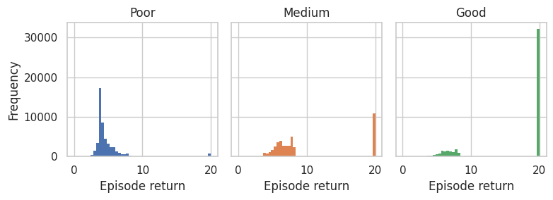
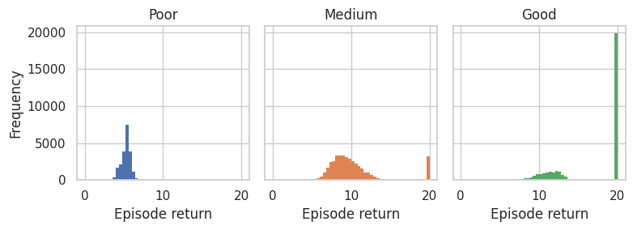

<!DOCTYPE html><html lang="en"><head>    <meta charset="UTF-8">    <meta name="viewport" content="width=device-width, initial-scale=1.0">    <title>Dataset Cards - OG MARL</title>    <link rel="stylesheet" href="styles.css">    </head><body>    
        <h1>Dataset Cards - OG MARL</h1>        

<h2>3m - <a href='https://huggingface.co/datasets/InstaDeepAI/og-marl/resolve/main/core/smac_v1/3m.zip'>Download</a></h2><h3>Metadata</h3>
<table><tr><th>Environment name</th><th>Version</th><th>Agents</th><th>Action size</th><th>Observation size</th><th>Reward type</th></tr><tr><td>SMAC (v1)</td><td><a href='https://github.com/oxwhirl/smac/releases/tag/v1'>SMAC V1</a>, from OxWhiRL</td><td>3</td><td>1</td><td>[30]</td><td>Dense</td></tr></table>
<h3>Generation procedure for each dataset</h3>
A QMIX system was trained to target level of performance. The learnt policy was then rolled out to collect approximately 250k transitions. An epsilon greedy policy with eps=0.05 was used. This procedure was repeated 4 times and the data was combined.
<h3>Summary statistics</h3>
<table><tr><th>Uid</th><th>Episode return mean</th><th>Min return</th><th>Max return</th><th>Transitions</th><th>Trajectories</th><th>Joint SACo</th></tr><tr><td>Poor</td><td>4.69 &#177; 2.14</td><td>0.00</td><td>20.00</td><td>997370</td><td>48779</td><td>0.81</td></tr><tr><td>Medium</td><td>9.96 &#177; 6.06</td><td>0.00</td><td>20.00</td><td>995313</td><td>41619</td><td>0.85</td></tr><tr><td>Good</td><td>16.49 &#177; 5.92</td><td>0.00</td><td>20.00</td><td>996366</td><td>43559</td><td>0.80</td></tr></table>

<h2>8m - <a href='https://huggingface.co/datasets/InstaDeepAI/og-marl/resolve/main/core/smac_v1/8m.zip'>Download</a></h2><h3>Metadata</h3>
<table><tr><th>Environment name</th><th>Version</th><th>Agents</th><th>Action size</th><th>Observation size</th><th>Reward type</th></tr><tr><td>SMAC (v1)</td><td><a href='https://github.com/oxwhirl/smac/releases/tag/v1'>SMAC V1</a>, from OxWhiRL</td><td>8</td><td>1</td><td>[80]</td><td>Dense</td></tr></table>
<h3>Generation procedure for each dataset</h3>
A QMIX system was trained to target level of performance. The learnt policy was then rolled out to collect approximately 250k transitions. An epsilon greedy policy with eps=0.05 was used. This procedure was repeated 4 times and the data was combined.
<h3>Summary statistics</h3>
<table><tr><th>Uid</th><th>Episode return mean</th><th>Min return</th><th>Max return</th><th>Transitions</th><th>Trajectories</th><th>Joint SACo</th></tr><tr><td>Poor</td><td>5.28 &#177; 0.56</td><td>0.00</td><td>7.62</td><td>995144</td><td>20629</td><td>0.64</td></tr><tr><td>Medium</td><td>10.14 &#177; 3.34</td><td>0.00</td><td>20.00</td><td>996501</td><td>39208</td><td>0.96</td></tr><tr><td>Good</td><td>16.86 &#177; 4.33</td><td>0.19</td><td>20.00</td><td>997785</td><td>30638</td><td>0.86</td></tr></table>

<h2>5m_vs_6m - <a href='https://huggingface.co/datasets/InstaDeepAI/og-marl/resolve/main/core/smac_v1/5m_vs_6m.zip'>Download</a></h2><h3>Metadata</h3>
<table><tr><th>Environment name</th><th>Version</th><th>Agents</th><th>Action size</th><th>Observation size</th><th>Reward type</th></tr><tr><td>SMAC (v1)</td><td><a href='https://github.com/oxwhirl/smac/releases/tag/v1'>SMAC V1</a>, from OxWhiRL</td><td>5</td><td>1</td><td>[55]</td><td>Dense</td></tr></table>
<h3>Generation procedure for each dataset</h3>
A QMIX system was trained to target level of performance. The learnt policy was then rolled out to collect approximately 250k transitions. An epsilon greedy policy with eps=0.05 was used. This procedure was repeated 4 times and the data was combined.
<h3>Summary statistics</h3>
<table><tr><th>Uid</th><th>Episode return mean</th><th>Min return</th><th>Max return</th><th>Transitions</th><th>Trajectories</th><th>Joint SACo</th></tr><tr><td>Poor</td><td>7.45 &#177; 1.48</td><td>0.00</td><td>20.00</td><td>934505</td><td>45501</td><td>0.85</td></tr><tr><td>Medium</td><td>12.62 &#177; 5.06</td><td>0.00</td><td>20.00</td><td>996856</td><td>39284</td><td>0.87</td></tr><tr><td>Good</td><td>16.58 &#177; 4.69</td><td>0.00</td><td>20.00</td><td>996727</td><td>36311</td><td>0.84</td></tr></table>

<h2>2s3z - <a href='https://huggingface.co/datasets/InstaDeepAI/og-marl/resolve/main/core/smac_v1/2s3z.zip'>Download</a></h2><h3>Metadata</h3>
<table><tr><th>Environment name</th><th>Version</th><th>Agents</th><th>Action size</th><th>Observation size</th><th>Reward type</th></tr><tr><td>SMAC (v1)</td><td><a href='https://github.com/oxwhirl/smac/releases/tag/v1'>SMAC V1</a>, from OxWhiRL</td><td>5</td><td>1</td><td>[80]</td><td>Dense</td></tr></table>
<h3>Generation procedure for each dataset</h3>
A QMIX system was trained to target level of performance. The learnt policy was then rolled out to collect approximately 250k transitions. An epsilon greedy policy with eps=0.05 was used. This procedure was repeated 4 times and the data was combined.
<h3>Summary statistics</h3>
<table><tr><th>Uid</th><th>Episode return mean</th><th>Min return</th><th>Max return</th><th>Transitions</th><th>Trajectories</th><th>Joint SACo</th></tr><tr><td>Poor</td><td>6.88 &#177; 2.06</td><td>0.00</td><td>13.61</td><td>996418</td><td>9942</td><td>0.96</td></tr><tr><td>Medium</td><td>12.57 &#177; 3.14</td><td>0.00</td><td>21.30</td><td>996256</td><td>18605</td><td>0.98</td></tr><tr><td>Good</td><td>18.32 &#177; 2.95</td><td>0.00</td><td>21.62</td><td>995829</td><td>18616</td><td>0.98</td></tr></table>

<h2>3s5z_vs_3s6z - <a href='https://huggingface.co/datasets/InstaDeepAI/og-marl/resolve/main/core/smac_v1/3s5z_vs_3s6z.zip'>Download</a></h2><h3>Metadata</h3>
<table><tr><th>Environment name</th><th>Version</th><th>Agents</th><th>Action size</th><th>Observation size</th><th>Reward type</th></tr><tr><td>SMAC (v1)</td><td><a href='https://github.com/oxwhirl/smac/releases/tag/v1'>SMAC V1</a>, from OxWhiRL</td><td>8</td><td>1</td><td>[136]</td><td>Dense</td></tr></table>
<h3>Generation procedure for each dataset</h3>
A QMIX system was trained to target level of performance. The learnt policy was then rolled out to collect approximately 250k transitions. An epsilon greedy policy with eps=0.05 was used. This procedure was repeated 4 times and the data was combined.
<h3>Summary statistics</h3>
<table><tr><th>Uid</th><th>Episode return mean</th><th>Min return</th><th>Max return</th><th>Transitions</th><th>Trajectories</th><th>Joint SACo</th></tr><tr><td>Poor</td><td>5.90 &#177; 2.22</td><td>0.19</td><td>11.93</td><td>996474</td><td>17807</td><td>0.96</td></tr><tr><td>Medium</td><td>10.69 &#177; 1.49</td><td>0.00</td><td>17.67</td><td>996699</td><td>18866</td><td>0.97</td></tr><tr><td>Good</td><td>16.56 &#177; 3.72</td><td>6.30</td><td>24.46</td><td>996528</td><td>7315</td><td>0.97</td></tr></table>

<h2>terran_5_vs_5 - <a href='https://huggingface.co/datasets/InstaDeepAI/og-marl/resolve/main/core/smac_v2/terran_5_vs_5.zip'>Download</a></h2><h3>Metadata</h3>
<table><tr><th>Environment name</th><th>Version</th><th>Agents</th><th>Action size</th><th>Observation size</th><th>Reward type</th></tr><tr><td>SMAC (v2)</td><td><a href='https://github.com/oxwhirl/smacv2'>SMAC V2</a>, from OxWhiRL</td><td>5</td><td>1</td><td>[82]</td><td>Dense</td></tr></table>
<h3>Generation procedure for each dataset</h3>
A QMIX system was trained to target level of performance. The learnt policy was then rolled out to collect approximately 250k transitions. An epsilon greedy policy with eps=0.05 was used. This procedure was repeated 4 times and the data was combined.
<h3>Summary statistics</h3>
<table><tr><th>Uid</th><th>Episode return mean</th><th>Min return</th><th>Max return</th><th>Transitions</th><th>Trajectories</th><th>Joint SACo</th></tr><tr><td>Replay</td><td>10.05 &#177; 5.84</td><td>0.00</td><td>36.34</td><td>898164</td><td>17958</td><td>1.00</td></tr><tr><td>Random</td><td>2.43 &#177; 1.73</td><td>0.00</td><td>16.18</td><td>1500000</td><td>37874</td><td>0.91</td></tr></table>

<h2>terran_10_vs_10 - <a href='https://huggingface.co/datasets/InstaDeepAI/og-marl/resolve/main/core/smac_v2/terran_10_vs_10.zip'>Download</a></h2><h3>Metadata</h3>
<table><tr><th>Environment name</th><th>Version</th><th>Agents</th><th>Action size</th><th>Observation size</th><th>Reward type</th></tr><tr><td>SMAC (v2)</td><td><a href='https://github.com/oxwhirl/smacv2'>SMAC V2</a>, from OxWhiRL</td><td>10</td><td>1</td><td>[162]</td><td>Dense</td></tr></table>
<h3>Generation procedure for each dataset</h3>
A QMIX system was trained to target level of performance. The learnt policy was then rolled out to collect approximately 1m transitions. An epsilon greedy policy with eps=0.05 was used.
<h3>Summary statistics</h3>
<table><tr><th>Uid</th><th>Episode return mean</th><th>Min return</th><th>Max return</th><th>Transitions</th><th>Trajectories</th><th>Joint SACo</th></tr><tr><td>Replay</td><td>6.32 &#177; 3.62</td><td>0.00</td><td>23.01</td><td>749850</td><td>13588</td><td>1.00</td></tr></table>

<h2>zerg_5_vs_5 - <a href='https://huggingface.co/datasets/InstaDeepAI/og-marl/resolve/main/core/smac_v2/zerg_5_vs_5.zip'>Download</a></h2><h3>Metadata</h3>
<table><tr><th>Environment name</th><th>Version</th><th>Agents</th><th>Action size</th><th>Observation size</th><th>Reward type</th></tr><tr><td>SMAC (v2)</td><td><a href='https://github.com/oxwhirl/smacv2'>SMAC V2</a>, from OxWhiRL</td><td>5</td><td>1</td><td>[82]</td><td>Dense</td></tr></table>
<h3>Generation procedure for each dataset</h3>
A QMIX system was trained to target level of performance. The learnt policy was then rolled out to collect approximately 1m transitions. An epsilon greedy policy with eps=0.05 was used.
<h3>Summary statistics</h3>
<table><tr><th>Uid</th><th>Episode return mean</th><th>Min return</th><th>Max return</th><th>Transitions</th><th>Trajectories</th><th>Joint SACo</th></tr><tr><td>Replay</td><td>7.34 &#177; 3.60</td><td>0.00</td><td>24.00</td><td>863281</td><td>23294</td><td>1.00</td></tr></table>

<h2>2halfcheetah - <a href='https://huggingface.co/datasets/InstaDeepAI/og-marl/resolve/main/core/mamujoco/2halfcheetah.zip'>Download</a></h2><h3>Metadata</h3>
<table><tr><th>Environment name</th><th>Version</th><th>Agents</th><th>Action size</th><th>Observation size</th><th>Reward type</th></tr><tr><td>MAMuJoCo</td><td><a href='https://github.com/schroederdewitt/multiagent_mujoco/releases/tag/v1.1'>V1.1</a>, Mujoco v210</td><td>2</td><td>[2, 3]</td><td>[13]</td><td>Dense</td></tr></table>
<h3>Generation procedure for each dataset</h3>
A MATD3 system was trained to target level of performance. The learnt policy was then rolled out to collect approximately 250k transitions. Gaussian noise with standard deviation of 0.2 was added to the action selection. This procedure was repeated 4 times and the data was combined.
<h3>Summary statistics</h3>
<table><tr><th>Uid</th><th>Episode return mean</th><th>Min return</th><th>Max return</th><th>Transitions</th><th>Trajectories</th><th>Joint SACo</th></tr><tr><td>Poor</td><td>400.45 &#177; 333.96</td><td>-191.49</td><td>905.03</td><td>1000000</td><td>1000</td><td>1.00</td></tr><tr><td>Medium</td><td>1485.00 &#177; 469.14</td><td>689.43</td><td>2332.17</td><td>1000000</td><td>1000</td><td>1.00</td></tr><tr><td>Good</td><td>6924.11 &#177; 1270.39</td><td>803.12</td><td>9132.25</td><td>1000000</td><td>1000</td><td>1.00</td></tr></table>

</body></html>