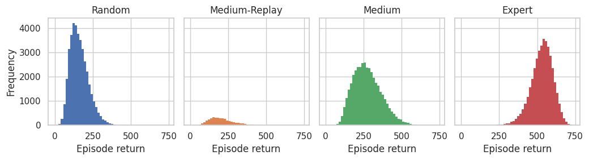

<!DOCTYPE html><html lang="en"><head>    <meta charset="UTF-8">    <meta name="viewport" content="width=device-width, initial-scale=1.0">    <title>Dataset Cards - OMAR</title>    <link rel="stylesheet" href="styles.css">    </head><body>    
        <h1>Dataset Cards - OMAR</h1>        

<h2>simple_spread - <a href='https://huggingface.co/datasets/InstaDeepAI/og-marl/resolve/main/prior_work/omar/mpe/simple_spread.zip'>Download</a></h2><h3>Metadata</h3>
<table><tr><th>Environment name</th><th>Version</th><th>Agents</th><th>Action type</th><th>Observation size</th><th>Reward type</th></tr><tr><td>MPE</td><td><a href='https://github.com/ling-pan/OMAR/tree/master/multiagent-particle-envs'>Code included in OMAR repository<a></td><td>3</td><td>Discrete</td><td>[18]</td><td>Dense</td></tr></table>
<h3>Generation procedure for each dataset</h3>
Converted from omar format to a Vault.
<h3>Summary statistics</h3>
<table><tr><th>Uid</th><th>Episode return mean</th><th>Min return</th><th>Max return</th><th>Transitions</th><th>Trajectories</th><th>Joint SACo</th></tr><tr><td>Random</td><td>159.57 &#177; 60.46</td><td>-5.43</td><td>510.05</td><td>1000000</td><td>40000</td><td>1.00</td></tr><tr><td>Medium-Replay</td><td>203.74 &#177; 80.49</td><td>35.69</td><td>582.09</td><td>97500</td><td>3900</td><td>1.00</td></tr><tr><td>Medium</td><td>273.39 &#177; 92.06</td><td>27.35</td><td>649.51</td><td>1000000</td><td>40000</td><td>1.00</td></tr><tr><td>Expert</td><td>530.95 &#177; 71.41</td><td>54.96</td><td>743.89</td><td>1000000</td><td>40000</td><td>1.00</td></tr></table>

<h2>simple_tag - <a href='https://huggingface.co/datasets/InstaDeepAI/og-marl/resolve/main/prior_work/omar/mpe/simple_tag.zip'>Download</a></h2><h3>Metadata</h3>
<table><tr><th>Environment name</th><th>Version</th><th>Agents</th><th>Action type</th><th>Observation size</th><th>Reward type</th></tr><tr><td>MPE</td><td><a href='https://github.com/ling-pan/OMAR/tree/master/multiagent-particle-envs'>Code included in OMAR repository<a></td><td>4</td><td>Discrete</td><td>[16]</td><td>Dense</td></tr></table>
<h3>Generation procedure for each dataset</h3>
Converted from omar format to a Vault.
<h3>Summary statistics</h3>
<table><tr><th>Uid</th><th>Episode return mean</th><th>Min return</th><th>Max return</th><th>Transitions</th><th>Trajectories</th><th>Joint SACo</th></tr><tr><td>Random</td><td>-4.13 &#177; 10.81</td><td>-20.18</td><td>117.09</td><td>1000000</td><td>40000</td><td>1.00</td></tr><tr><td>Medium-Replay</td><td>3.90 &#177; 20.28</td><td>-17.11</td><td>146.12</td><td>62500</td><td>2500</td><td>1.00</td></tr><tr><td>Medium</td><td>116.36 &#177; 58.86</td><td>-12.66</td><td>418.25</td><td>1000000</td><td>40000</td><td>1.00</td></tr><tr><td>Expert</td><td>207.90 &#177; 77.51</td><td>-16.04</td><td>549.20</td><td>1000000</td><td>40000</td><td>1.00</td></tr></table>

<h2>simple_world - <a href='https://huggingface.co/datasets/InstaDeepAI/og-marl/resolve/main/prior_work/omar/mpe/simple_world.zip'>Download</a></h2><h3>Metadata</h3>
<table><tr><th>Environment name</th><th>Version</th><th>Agents</th><th>Action type</th><th>Observation size</th><th>Reward type</th></tr><tr><td>MPE</td><td><a href='https://github.com/ling-pan/OMAR/tree/master/multiagent-particle-envs'>Code included in OMAR repository<a></td><td>4</td><td>Discrete</td><td>[24]</td><td>Dense</td></tr></table>
<h3>Generation procedure for each dataset</h3>
Converted from omar format to a Vault.
<h3>Summary statistics</h3>
<table><tr><th>Uid</th><th>Episode return mean</th><th>Min return</th><th>Max return</th><th>Transitions</th><th>Trajectories</th><th>Joint SACo</th></tr><tr><td>Random</td><td>-6.83 &#177; 5.74</td><td>-17.81</td><td>54.41</td><td>1000000</td><td>40000</td><td>1.00</td></tr><tr><td>Medium-Replay</td><td>1.23 &#177; 13.49</td><td>-17.56</td><td>112.90</td><td>80000</td><td>3200</td><td>1.00</td></tr><tr><td>Medium</td><td>65.86 &#177; 29.55</td><td>-9.15</td><td>198.82</td><td>1000000</td><td>40000</td><td>1.00</td></tr><tr><td>Expert</td><td>85.21 &#177; 31.11</td><td>-11.55</td><td>238.70</td><td>1000000</td><td>40000</td><td>1.00</td></tr></table>

<h2>2halfcheetah - <a href='https://huggingface.co/datasets/InstaDeepAI/og-marl/resolve/main/prior_work/omar/mamujoco/2halfcheetah.zip'>Download</a></h2><h3>Metadata</h3>
<table><tr><th>Environment name</th><th>Version</th><th>Agents</th><th>Action type</th><th>Observation size</th><th>Reward type</th></tr><tr><td>MAMuJoCo</td><td><a href='https://github.com/schroederdewitt/multiagent_mujoco/releases/tag/v1.0'>V1.0</a>, Mujoco v200</td><td>2</td><td>Continuous</td><td>[6]</td><td>Dense</td></tr></table>
<h3>Generation procedure for each dataset</h3>
Converted from omar format to a Vault.
<h3>Summary statistics</h3>
<table><tr><th>Uid</th><th>Episode return mean</th><th>Min return</th><th>Max return</th><th>Transitions</th><th>Trajectories</th><th>Joint SACo</th></tr><tr><td>Random</td><td>-282.89 &#177; 77.50</td><td>-516.90</td><td>-62.62</td><td>1000000</td><td>1000</td><td>1.00</td></tr><tr><td>Medium-Replay</td><td>423.49 &#177; 655.68</td><td>-509.10</td><td>1993.00</td><td>460000</td><td>460</td><td>1.00</td></tr><tr><td>Medium</td><td>1568.87 &#177; 273.38</td><td>20.49</td><td>1904.56</td><td>1000000</td><td>1000</td><td>1.00</td></tr><tr><td>Expert</td><td>3338.69 &#177; 252.58</td><td>852.45</td><td>3605.42</td><td>1000000</td><td>1000</td><td>1.00</td></tr></table>

</body></html>