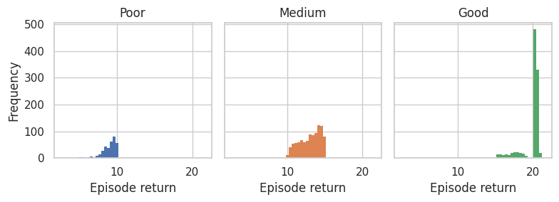
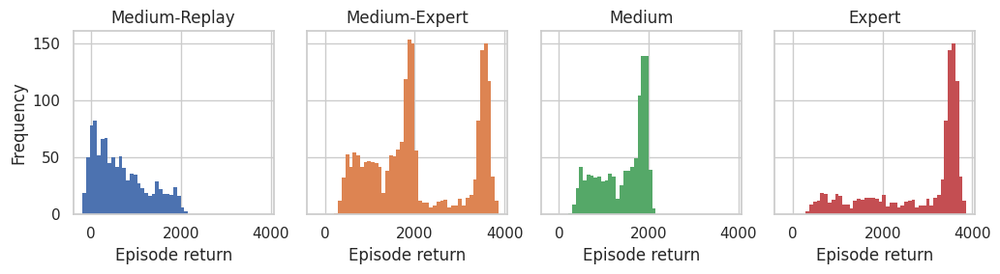

<!DOCTYPE html><html lang="en"><head>    <meta charset="UTF-8">    <meta name="viewport" content="width=device-width, initial-scale=1.0">    <title>Dataset Cards - OMIGA</title>    <link rel="stylesheet" href="styles.css">    </head><body>    
        <h1>Dataset Cards - OMIGA</h1>        

<h2>2c_vs_64zg - <a href='https://huggingface.co/datasets/InstaDeepAI/og-marl/resolve/main/prior_work/omiga/smac_v1/2c_vs_64zg.zip'>Download</a></h2><h3>Metadata</h3>
<table><tr><th>Environment name</th><th>Version</th><th>Agents</th><th>Action type</th><th>Observation size</th><th>Reward type</th></tr><tr><td>SMAC (v1)</td><td>Modified version of SMAC v1, popularised by <a href='https://github.com/sanmuyang/multi-agent-PPO-on-SMAC?tab=readme-ov-file'>MAPPO </a></td><td>2</td><td>Discrete</td><td>[478]</td><td>Dense</td></tr></table>
<h3>Generation procedure for each dataset</h3>
Converted from omiga format to a Vault.
<h3>Summary statistics</h3>
<table><tr><th>Uid</th><th>Episode return mean</th><th>Min return</th><th>Max return</th><th>Transitions</th><th>Trajectories</th><th>Joint SACo</th></tr><tr><td>Poor</td><td>8.91 &#177; 1.01</td><td>2.53</td><td>10.00</td><td>10830</td><td>348</td><td>1.00</td></tr><tr><td>Medium</td><td>13.00 &#177; 1.39</td><td>10.01</td><td>15.00</td><td>37940</td><td>1001</td><td>1.00</td></tr><tr><td>Good</td><td>19.94 &#177; 1.26</td><td>15.18</td><td>21.61</td><td>59215</td><td>1001</td><td>1.00</td></tr></table>

<h2>6h_vs_8z - <a href='https://huggingface.co/datasets/InstaDeepAI/og-marl/resolve/main/prior_work/omiga/smac_v1/6h_vs_8z.zip'>Download</a></h2><h3>Metadata</h3>
<table><tr><th>Environment name</th><th>Version</th><th>Agents</th><th>Action type</th><th>Observation size</th><th>Reward type</th></tr><tr><td>SMAC (v1)</td><td>Modified version of SMAC v1, popularised by <a href='https://github.com/sanmuyang/multi-agent-PPO-on-SMAC?tab=readme-ov-file'>MAPPO </a></td><td>6</td><td>Discrete</td><td>[172]</td><td>Dense</td></tr></table>
<h3>Generation procedure for each dataset</h3>
Converted from omiga format to a Vault.
<h3>Summary statistics</h3>
<table><tr><th>Uid</th><th>Episode return mean</th><th>Min return</th><th>Max return</th><th>Transitions</th><th>Trajectories</th><th>Joint SACo</th></tr><tr><td>Poor</td><td>9.12 &#177; 0.81</td><td>4.80</td><td>9.99</td><td>24255</td><td>1001</td><td>1.00</td></tr><tr><td>Medium</td><td>11.97 &#177; 1.26</td><td>10.00</td><td>14.99</td><td>29511</td><td>1001</td><td>1.00</td></tr><tr><td>Good</td><td>17.84 &#177; 2.15</td><td>15.01</td><td>20.02</td><td>38040</td><td>1001</td><td>1.00</td></tr></table>

<h2>5m_vs_6m - <a href='https://huggingface.co/datasets/InstaDeepAI/og-marl/resolve/main/prior_work/omiga/smac_v1/5m_vs_6m.zip'>Download</a></h2><h3>Metadata</h3>
<table><tr><th>Environment name</th><th>Version</th><th>Agents</th><th>Action type</th><th>Observation size</th><th>Reward type</th></tr><tr><td>SMAC (v1)</td><td>Modified version of SMAC v1, popularised by <a href='https://github.com/sanmuyang/multi-agent-PPO-on-SMAC?tab=readme-ov-file'>MAPPO </a></td><td>5</td><td>Discrete</td><td>[124]</td><td>Dense</td></tr></table>
<h3>Generation procedure for each dataset</h3>
Converted from omiga format to a Vault.
<h3>Summary statistics</h3>
<table><tr><th>Uid</th><th>Episode return mean</th><th>Min return</th><th>Max return</th><th>Transitions</th><th>Trajectories</th><th>Joint SACo</th></tr><tr><td>Poor</td><td>8.50 &#177; 1.19</td><td>1.81</td><td>9.89</td><td>22747</td><td>1001</td><td>0.96</td></tr><tr><td>Medium</td><td>11.03 &#177; 0.58</td><td>10.08</td><td>11.96</td><td>27717</td><td>1001</td><td>0.95</td></tr><tr><td>Good</td><td>20.00 &#177; 0.00</td><td>20.00</td><td>20.00</td><td>27734</td><td>1001</td><td>0.96</td></tr></table>

<h2>corridor - <a href='https://huggingface.co/datasets/InstaDeepAI/og-marl/resolve/main/prior_work/omiga/smac_v1/corridor.zip'>Download</a></h2><h3>Metadata</h3>
<table><tr><th>Environment name</th><th>Version</th><th>Agents</th><th>Action type</th><th>Observation size</th><th>Reward type</th></tr><tr><td>SMAC (v1)</td><td>Modified version of SMAC v1, popularised by <a href='https://github.com/sanmuyang/multi-agent-PPO-on-SMAC?tab=readme-ov-file'>MAPPO </a></td><td>6</td><td>Discrete</td><td>[346]</td><td>Dense</td></tr></table>
<h3>Generation procedure for each dataset</h3>
Converted from omiga format to a Vault.
<h3>Summary statistics</h3>
<table><tr><th>Uid</th><th>Episode return mean</th><th>Min return</th><th>Max return</th><th>Transitions</th><th>Trajectories</th><th>Joint SACo</th></tr><tr><td>Poor</td><td>4.93 &#177; 1.71</td><td>0.00</td><td>9.99</td><td>51268</td><td>1001</td><td>1.00</td></tr><tr><td>Medium</td><td>13.07 &#177; 1.27</td><td>10.02</td><td>14.99</td><td>126012</td><td>1001</td><td>1.00</td></tr><tr><td>Good</td><td>19.88 &#177; 1.01</td><td>15.01</td><td>20.49</td><td>100170</td><td>1001</td><td>1.00</td></tr></table>

<h2>6halfcheetah - <a href='https://huggingface.co/datasets/InstaDeepAI/og-marl/resolve/main/prior_work/omiga/mamujoco/6halfcheetah.zip'>Download</a></h2><h3>Metadata</h3>
<table><tr><th>Environment name</th><th>Version</th><th>Agents</th><th>Action type</th><th>Observation size</th><th>Reward type</th></tr><tr><td>MAMuJoCo</td><td><a href='https://github.com/schroederdewitt/multiagent_mujoco/releases/tag/v1.0'>V1.0</a>, Mujoco v200</td><td>6</td><td>Continuous</td><td>[23]</td><td>Dense</td></tr></table>
<h3>Generation procedure for each dataset</h3>
Converted from omiga format to a Vault.
<h3>Summary statistics</h3>
<table><tr><th>Uid</th><th>Episode return mean</th><th>Min return</th><th>Max return</th><th>Transitions</th><th>Trajectories</th><th>Joint SACo</th></tr><tr><td>Medium-Replay</td><td>655.76 &#177; 590.40</td><td>-198.77</td><td>2132.60</td><td>1001000</td><td>1000</td><td>1.00</td></tr><tr><td>Medium-Expert</td><td>2105.38 &#177; 1073.24</td><td>251.94</td><td>3866.09</td><td>2002000</td><td>2000</td><td>1.00</td></tr><tr><td>Medium</td><td>1425.66 &#177; 520.12</td><td>251.94</td><td>2113.52</td><td>1001000</td><td>1000</td><td>1.00</td></tr><tr><td>Expert</td><td>2785.10 &#177; 1053.14</td><td>317.94</td><td>3866.09</td><td>1001000</td><td>1000</td><td>1.00</td></tr></table>

<h2>2ant - <a href='https://huggingface.co/datasets/InstaDeepAI/og-marl/resolve/main/prior_work/omiga/mamujoco/2ant.zip'>Download</a></h2><h3>Metadata</h3>
<table><tr><th>Environment name</th><th>Version</th><th>Agents</th><th>Action type</th><th>Observation size</th><th>Reward type</th></tr><tr><td>MAMuJoCo</td><td><a href='https://github.com/schroederdewitt/multiagent_mujoco/releases/tag/v1.0'>V1.0</a>, Mujoco v200</td><td>2</td><td>Continuous</td><td>[113]</td><td>Dense</td></tr></table>
<h3>Generation procedure for each dataset</h3>
Converted from omiga format to a Vault.
<h3>Summary statistics</h3>
<table><tr><th>Uid</th><th>Episode return mean</th><th>Min return</th><th>Max return</th><th>Transitions</th><th>Trajectories</th><th>Joint SACo</th></tr><tr><td>Medium-Replay</td><td>1029.51 &#177; 141.27</td><td>895.37</td><td>1517.06</td><td>1751750</td><td>1750</td><td>0.66</td></tr><tr><td>Medium-Expert</td><td>1736.88 &#177; 319.64</td><td>840.77</td><td>2124.15</td><td>2002000</td><td>2000</td><td>1.00</td></tr><tr><td>Medium</td><td>1418.70 &#177; 37.04</td><td>840.77</td><td>1473.86</td><td>1001000</td><td>1000</td><td>1.00</td></tr><tr><td>Expert</td><td>2055.07 &#177; 22.07</td><td>1994.03</td><td>2124.15</td><td>1001000</td><td>1000</td><td>1.00</td></tr></table>

<h2>3hopper - <a href='https://huggingface.co/datasets/InstaDeepAI/og-marl/resolve/main/prior_work/omiga/mamujoco/3hopper.zip'>Download</a></h2><h3>Metadata</h3>
<table><tr><th>Environment name</th><th>Version</th><th>Agents</th><th>Action type</th><th>Observation size</th><th>Reward type</th></tr><tr><td>MAMuJoCo</td><td><a href='https://github.com/schroederdewitt/multiagent_mujoco/releases/tag/v1.0'>V1.0</a>, Mujoco v200</td><td>3</td><td>Continuous</td><td>[14]</td><td>Dense</td></tr></table>
<h3>Generation procedure for each dataset</h3>
Converted from omiga format to a Vault.
<h3>Summary statistics</h3>
<table><tr><th>Uid</th><th>Episode return mean</th><th>Min return</th><th>Max return</th><th>Transitions</th><th>Trajectories</th><th>Joint SACo</th></tr><tr><td>Medium-Replay</td><td>746.42 &#177; 671.89</td><td>70.76</td><td>2801.15</td><td>1314826</td><td>4160</td><td>1.00</td></tr><tr><td>Medium-Expert</td><td>1190.61 &#177; 973.40</td><td>95.27</td><td>3762.69</td><td>1919782</td><td>5481</td><td>1.00</td></tr><tr><td>Medium</td><td>723.57 &#177; 211.66</td><td>128.38</td><td>2776.49</td><td>919391</td><td>4000</td><td>1.00</td></tr><tr><td>Expert</td><td>2452.02 &#177; 1097.86</td><td>95.27</td><td>3762.69</td><td>1000391</td><td>1481</td><td>1.00</td></tr></table>

</body></html>