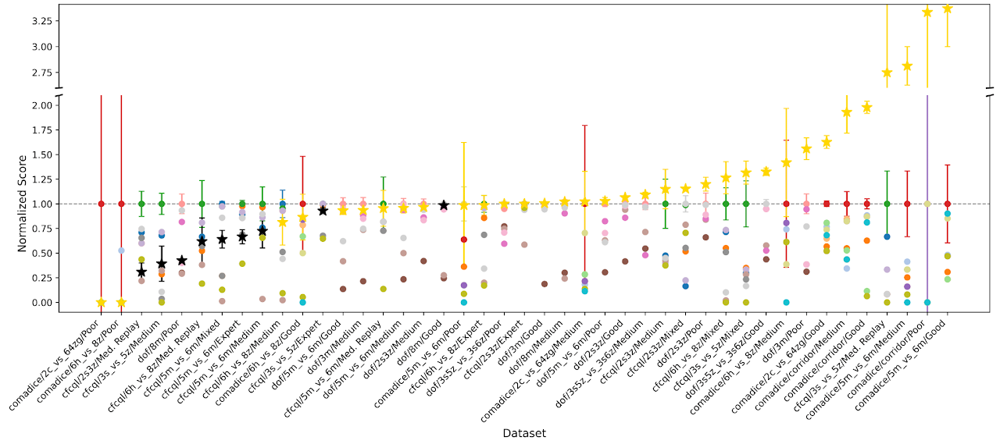
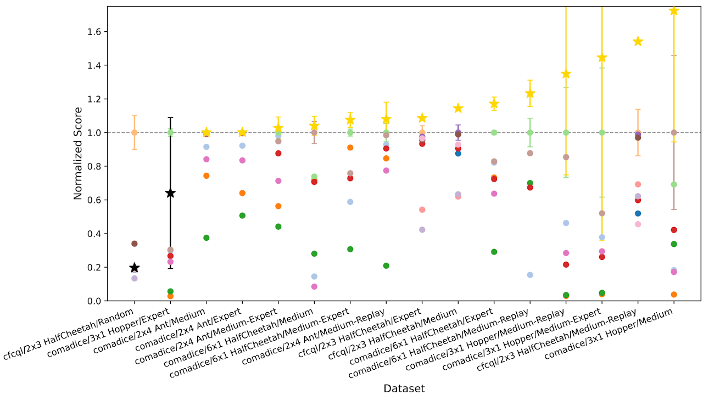
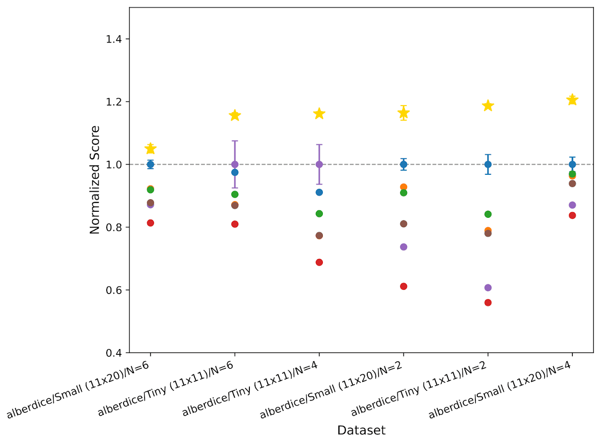
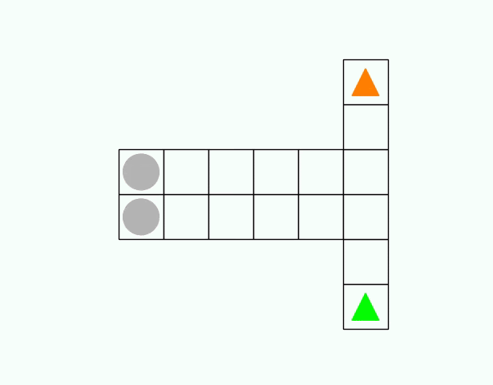
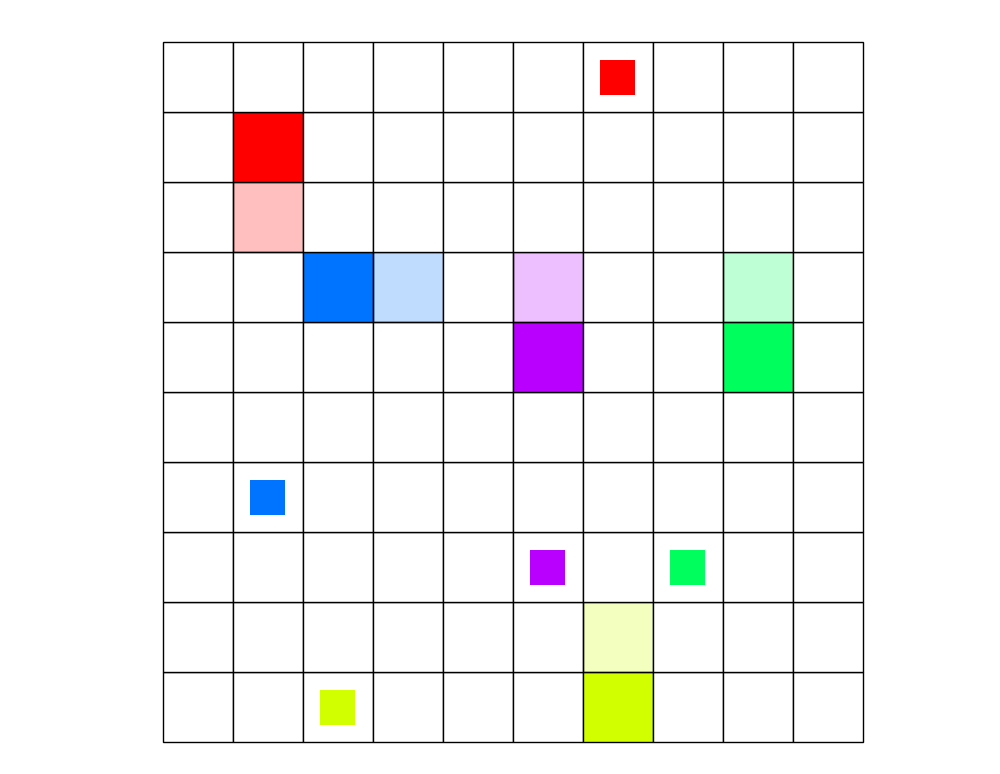
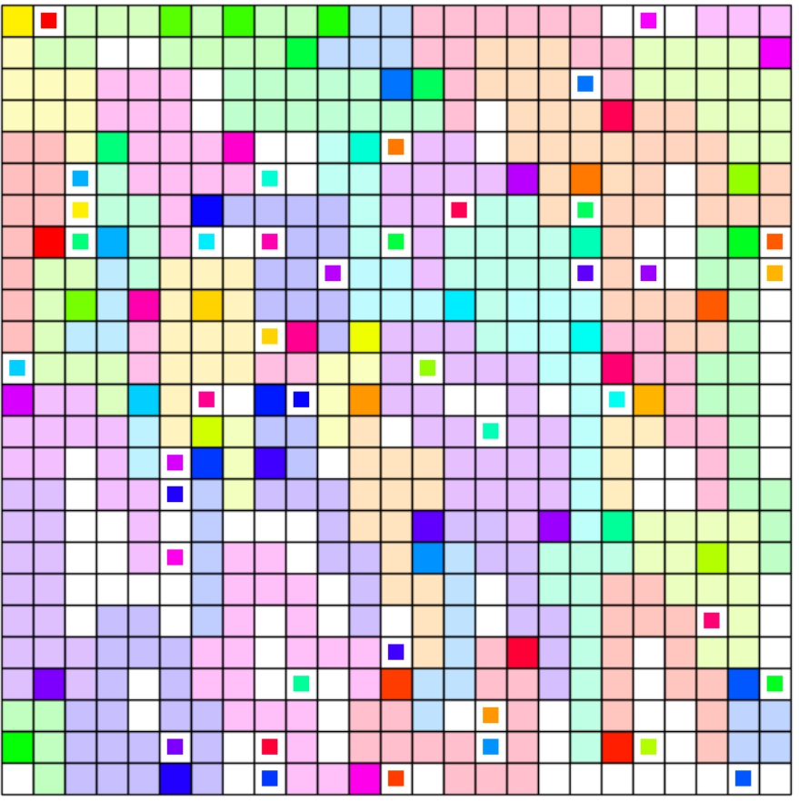

# Oryx: a Performant and Scalable Algorithm for Many-Agent Coordination in Offline MARL

# Overview

A key challenge in offline multi-agent reinforcement learning (MARL) is achieving effective many-agent multi-step coordination in complex environments. In this work, we propose Oryx, a novel algorithm for offline cooperative MARL to directly address this challenge. Oryx adapts the recently proposed retention-based architecture Sable and combines it with a sequential form of implicit constraint Q-learning (ICQ), to develop a novel offline auto-regressive policy update scheme. This allows Oryx to solve complex coordination challenges while maintaining temporal coherence over lengthy trajectories. We evaluate Oryx across a diverse set of benchmarks from prior works—SMAC, RWARE, and Multi-Agent MuJoCo—covering tasks of both discrete and continuous control, varying in scale and difficulty. Oryx achieves state-of-the-art performance on more than 80% of the 65 tested datasets, outperforming prior offline MARL methods and demonstrating robust generalisation across domains with many agents and long horizons. Finally, we introduce new datasets to push the limits of many-agent coordination in offline MARL, and demonstrate Oryx's surperior ability to scale effectively in such settings.

> Performance of Oryx across diverse benchmark datasets from prior literature. Scores are normalised relative to the current state-of-the-art, with values above 1 indicating that Oryx surpasses previous best-known results. Unnormalized scores are provided in the appendix. Gold stars indicate instances where Oryx matches or exceeds state-of-the-art performance, while black stars denote otherwise. 

# New Datasets

## TMAZE
The T-Maze environment is intentionally designed as a minimalist setting that isolates key challenges
for multi-agent reinforcement learning: interdependent action selection, reliance on memory from
previous timesteps, and effective coordination to achieve a common goal

## Connector
We generated a range of datasets on Connector, a very challenging coorination task amongst agents. In Connector, agents must travel from their spawn location to a target location without cutting each other off. The team is rewarded in proportion to how many agents successfully made it to their goals. Datasets with up to 50 agents were generated. 

| Task            | Samples  | Mean Return | Max Return | Min Return |
|:--------------- |:--------:|:-----------:|:----------:|:----------:|
| con-5x5x3a      | 1.17 M   |     0.59    |    0.97    |   −0.75    |
| con-7x7x5a      | 1.13 M   |     0.48    |    0.97    |   −1.23    |
| con-10x10x10a   | 1.09 M   |     0.40    |    0.97    |   −1.53    |
| con-15x15x23a   | 1.06 M   |     0.34    |    0.97    |   −1.56    |
| con-18x18x30a   | 1.00 M   |     0.25    |    0.97    |   −2.43    |
| con-22x22x40a   | 624 640  |     0.40    |    0.97    |   −2.61    |
| con-25x25x50a   | 624 640  |     0.33    |    0.97    |   −3.06    |