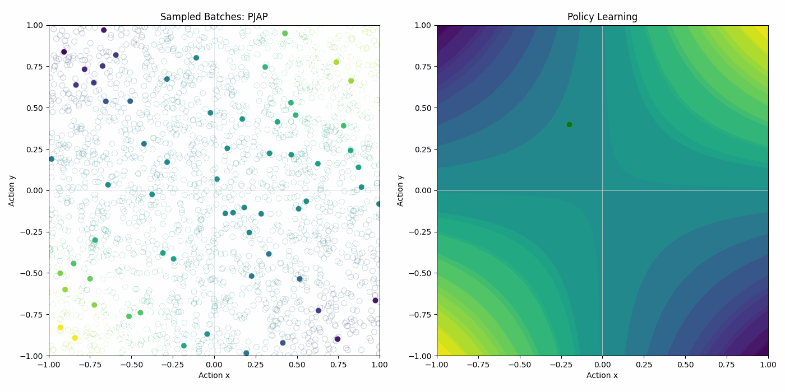
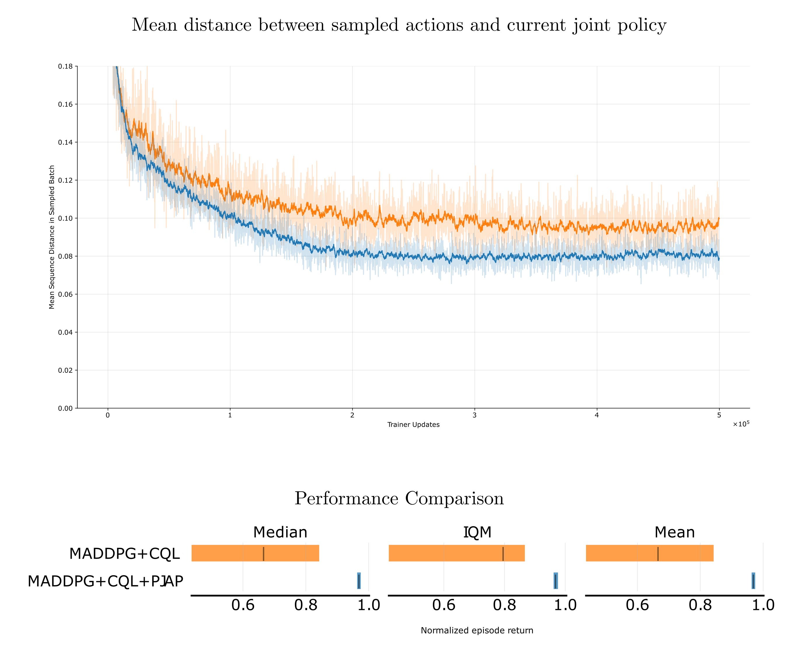
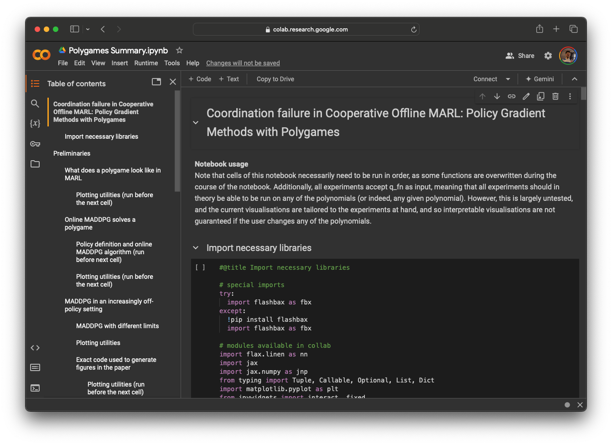

# Coordination Failure in Cooperative Offline MARL

*[Paper](https://arxiv.org/abs/2407.01343) | [Notebook](https://tinyurl.com/pjap-polygames) | [Announcement](https://x.com/callumtilbury/status/1816489404766224479)*

What happens when trying to learn multi-agent coordination from a static dataset? Catastrophe, if you’re not careful! This is the topic of our work on ✨Coordination Failure in Offline Multi-Agent Reinforcement Learning ✨

<p align="center"></p>

Many offline MARL methods build on an MADDPG-style update, which we call the “Best Response Under Dataset” (BRUD). Essentially, agents optimise their action in best response to the other agents’ actions, as sampled from the dataset 🤼

<p align="center">
    <b>But this can lead to catastrophic miscoordination! 🥊</b>
</p>

To illustrate this phenomenon, we use polynomial games for tractable insights. For example, consider a simple game, $R = xy$, dubbed the "sign-agreement" game. Agents X and Y aim to choose actions of the same sign ($++$ or $--$) to yield good rewards. 📈
<p align="center"></p>

Suppose in this game that Agent X currently takes a NEGATIVE action, and Agent Y currently takes a POSITIVE action—illustrated by the _Current Policy_ on the left. Now suppose we sample a point from the static dataset, where X took a POSITIVE action and Y took a negative action, illustrated on the right.

<p align="center"></p>

With a BRUD-style update, the agent policies will update according to the illustration below. Agent X looks at the datapoint, where Y took a negative action, and makes its action more negative in best response. The opposite happens for Agent Y when looking at the datapoint from X, making its action more positive.
<p align="center"></p>

The result is catastrophic! Agents move towards a low-reward region, in the opposite direction of the true optimal update. Our work goes further to ground this result mathematically, and demonstrates how and why other instances of miscoordination arise in a variety of polynomial games. 🤓
<p align="center"></p>

How do we solve this problem? Our key insight is that miscoordination arises because of  the dissimilarity between the current joint policy output, and the sampled joint action.

<p align="center">
    <b>⚠️ Not all data is equally important at all times ⚠️</b>
</p>

Instead: we want to prioritise sampling experience from a dataset-generating policy similar to the current joint policy. We do this by setting the priorities to be inversely proportional to some function of the distance between the policies.

We call this *Proximal Joint-Action Prioritisation (PJAP)* 🤠

Returning to the sign-agreement game from before, here we see how vanilla MADDPG using a static dataset fails to learn the optimal policy 😭 But the experience is just sampled uniformly from the dataset!
<p align="center"></p>

If we instead prioritise sampling actions that are close to our current joint policy, using PJAP, then MADDPG can find the optimal reward region! 🎉
<p align="center"></p>

Here’s a visualisation of the priorities in the underlying buffer. Prioritised experience replay is already a popular tool in RL, so PJAP can easily be integrated with existing code. 😌

<p align="center"></p>

In a more complex polynomial game, clear improvement occurs once again. Crucially, we see how the mean distance between the sampled actions and current policy is reduced, which leads to higher returns. 💃
<p align="center"></p>

Excitingly, this result transfers to more complex scenarios! Here we look at 2halfcheetah from MAMuJoCo, and see that PJAP yields lower average distance between the sample actions and the current joint policy, which leads to statistically significant higher returns 🐆🔥
<p align="center"></p>

Importantly, our work shows how insights drawn from simplified, tractable games can lead to useful, theoretically grounded insights that transfer to more complex contexts. A core dimension of offering is an interactive notebook, from which almost all of our results can be reproduced, simply in a browser! 💻

<a href="https://tinyurl.com/pjap-polygames" target="_blank">
    <p align="center"></p>
</a>

We presented this paper at the [ARLET workshop](https://icml.cc/virtual/2024/workshop/29964) at ICML 2024.


## Cite

```
@inproceedings{tilbury2024coordination,
    title={Coordination Failure in Cooperative Offline MARL},
    author={Tilbury, Callum Rhys and Formanek, Juan Claude and Beyers, Louise and Shock, Jonathan Phillip and Pretorius, Arnu},
    booktitle={ICML 2024 Workshop: Aligning Reinforcement Learning Experimentalists and Theorists},
    year={2024},
    url={https://arxiv.org/abs/2407.01343}
}
```
