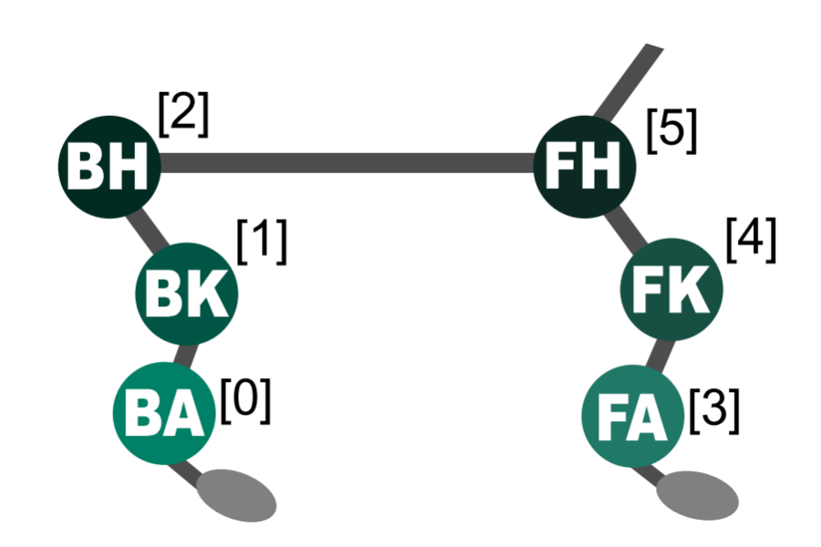
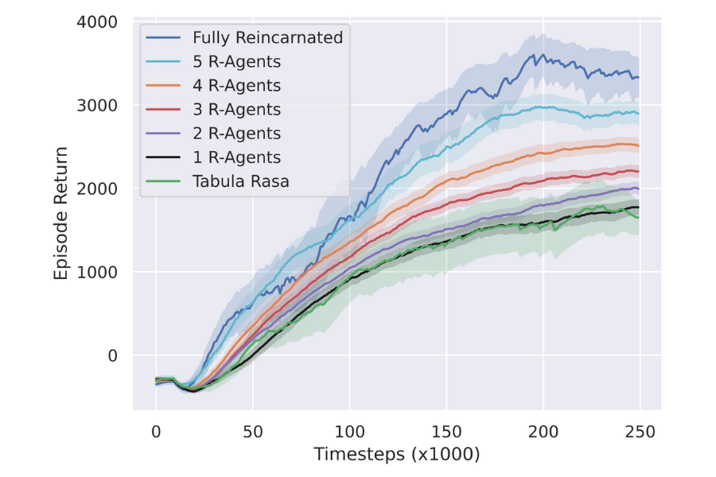
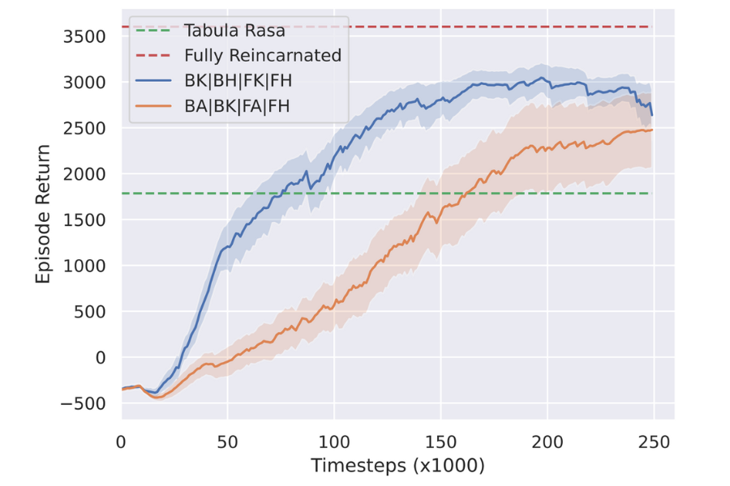

# Selective Reincarnation in Multi-Agent Reinforcement Learning

[Reincarnation](https://agarwl.github.io/reincarnating_rl/) in reinforcement learning has been proposed as a formalisation of reusing prior computation from past experiments when training an agent in an environment. In this work, we present a brief foray into the paradigm of reincarnation in the multi-agent reinforcement learning (MARL) context. We consider the case where only some agents are reincarnated, whereas the others are trained from scratch — *selective reincarnation*.

## Selectively-Reincarnated Policy-to-Value MARL
In this work we present a case study in multi-agent *policy-to-value RL* (PVRL), focusing on one of the methods invoked by [Agarwal et al. (2022)](https://arxiv.org/abs/2206.01626), called ‘Rehearsal’ ([Gülçehre et al., 2020](https://openreview.net/forum?id=SygKyeHKDH)).

For the sake of the current question of selective reincarnation, we use the 6-Agent HALFCHEETAH environment from [Multi-Agent MuJoCo](https://github.com/schroederdewitt/multiagent_mujoco), where each of the six degrees-of-freedom is controlled by a separate agent.

<p align="center"></p>

We enumerate all combinations of agents for reincarnation, a total of 2^6 = 64 subsets. For each subset, we retrain the system on HALFCHEETAH, where that particular group of agents gains access to their teacher's offline data (i.e. they are reincarnated). For each combination, we train the system for *200k* timesteps, remove the teacher data, and then train for a further *50k* timesteps on student data alone.

### Impact of Teacher Dataset Quality in Reincarnating MARL
First, we show that fully reincarnating a MARL system can speed up convergence. Additionally, we show that providing access solely to *Good* teacher data initially does not help speed up training and even seems to hamper it. It is only after around *125k* timesteps that we observe a dramatic peak in performance, thereafter significantly outperforming the *tabula rasa* system. In contrast, having additional *Medium* samples enables higher returns from the beginning of training – converging faster than the solely *Good* dataset.

<p align="center"></p>

### Arbitrarily Selective Reincarnation
Next we show that a selectively reincarnated setup also yields benefits – e.g. reincarnating with just half of the agents provides an improvement over *tabula rasa*.

<p align="center"></p>

### Targeted Selective Reincarnation Matters
Finally, we present a vital consideration: in a multi-agent system, even in the simpler homogeneous case, agents can sometimes assume dissimilar roles with different degrees of importance to the whole system. In the HALFCHEETAH environment particularly, consider the unique requirements for the ankle, knee, and hip joints, and how these differ across the front and back legs, in order for the cheetah to walk. It is thus important that we compare, for a given integer *x*, the results across various combinations of *x* reincarnated agents. That is, e.g., compare reincarnating the back ankle and back knee (BA, BK) with the back ankle and back hip (BA, BH). We find that the choice of which agents to reincarnate plays a significant role in the
experiment’s outcome.

#### Best and Worst of Three Reincarnated Agents
<p align="center"></p>

#### Best and Worst of Four Reincarnated Agents
<p align="center"></p>


#### Best and Worst of Five Reincarnated Agents
<p align="center"></p>

## Cite

```
@inproceedings{
    formanek2023selective,
    title={Reduce, Reuse, Recycle: Selective Reincarnation in Multi-Agent Reinforcement Learning},
    author={Juan Claude Formanek and Callum Rhys Tilbury and Jonathan Phillip Shock and Kale-ab Tessera and Arnu Pretorius},
    booktitle={Workshop on Reincarnating Reinforcement Learning at ICLR 2023},
    year={2023},
    url={https://openreview.net/forum?id=_Nz9lt2qQfV}
}
```
