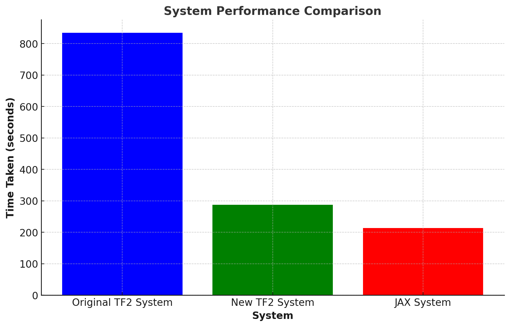
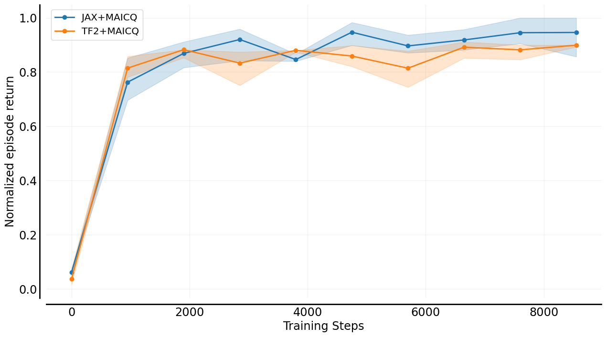
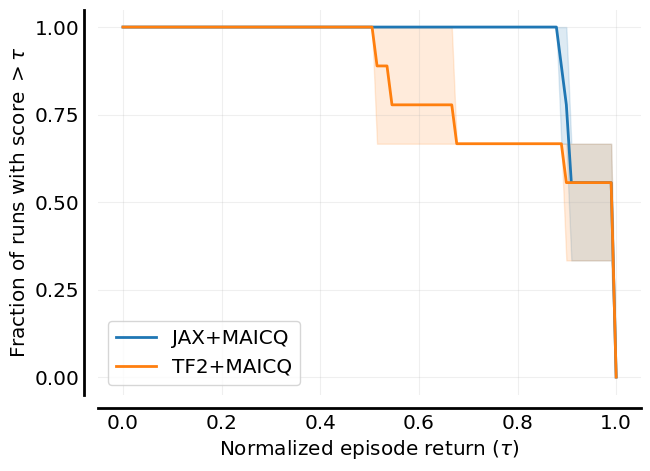

## Updates [06/12/2023] 📰

OG-MARL is a research tool that is under active development and therefore evolving quickly. We have several very exciting new features on the roadmap but sometimes when we introduce a new feature we may abruptly change how things work in OG-MARL.
But in the interest of moving quickly, we believe this is an acceptable trade-off and ask our users to kindly be aware of this.

The following is a list of the latest updates to OG-MARL:

✅ We have **removed several cumbersome dependencies** from OG-MARL, including `reverb` and `launchpad`. This means that its significantly easier to install and use OG-MARL.

✅ We added **functionality to pre-load the TF Record datasets into a [Cpprb](https://ymd_h.gitlab.io/cpprb/) replay buffer**. This speeds up the time to sample the replay buffer by several orders of magnitude.

✅ We have implemented our **first set of JAX-based systems in OG-MARL**. Our JAX systems use [Flashbax](https://github.com/instadeepai/flashbax) as the replay buffer backend. Flashbax buffers are completely jit-able, which means that our JAX systems have fully integrated and jitted training and data sampling.

✅ We have **integrated [MARL-eval](https://github.com/instadeepai/marl-eval/tree/main)** into OG-MARL to standardise and simplify the reporting of experimental results.

## Need for Speed 🏎️

We have made our TF2 systems compatible with jit compilation. This combined with our new `cpprb` replay buffers have made our systems significantly faster. Furthermore, our JAX systems with tightly integrated replay sampling and training using Flashbax are even faster.

**Speed Comparison**: for each setup, we trained MAICQ on the 8m Good dataset for 10k training steps and evaluated every 1k training steps for 4 episodes using a batch size of 256.

    

        
  

**Performance Comparison**: In order to make sure performance between the TF2 system and the JAX system is the same, we trained both variants on each of the three datasets for 8m (Good, Medium and Poor). We then normalised the scores and aggregated the results using MARL-eval. The sample efficiency curves and the performance profiles are given below.

  

    
    
  

